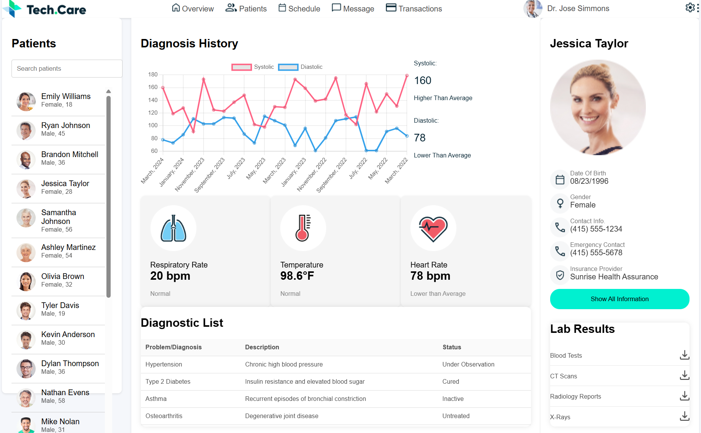

# Patient Health Dashboard

A web application to display detailed health information and diagnostic data for patients. The dashboard provides insights into various health metrics such as blood pressure, heart rate, and respiratory rate. It also includes a list of diagnoses and lab results for each patient.

## Features

- **Patient List**: Displays a list of patients with their basic information.
- **Patient Details**: Shows detailed health metrics and diagnostic history for selected patients.
- **Charts**: Visual representation of health metrics like blood pressure over time.
- **Lab Results**: List of recent lab tests with download options.
- The application will fetch and display patient data, allowing you to click on any patient to view their detailed health metrics and diagnostic history.

## Technologies Used

- **HTML5**
- **CSS3**
- **JavaScript**
- **Chart.js** for data visualization
- **Fetch API** for data retrieval

## Screenshot

